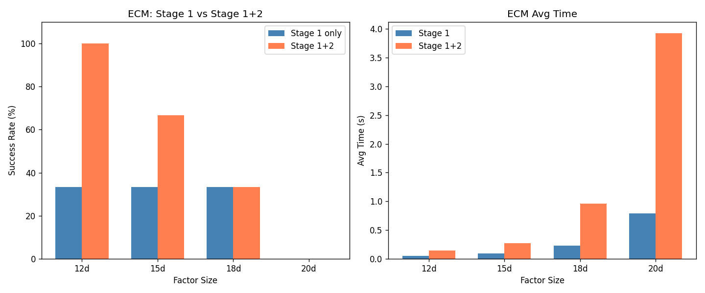
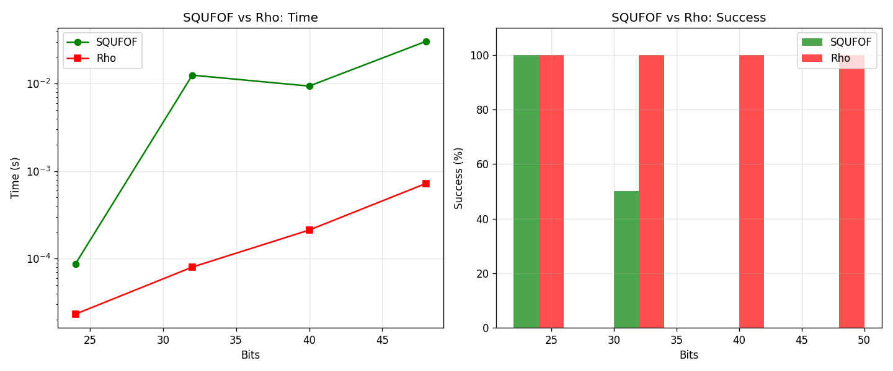
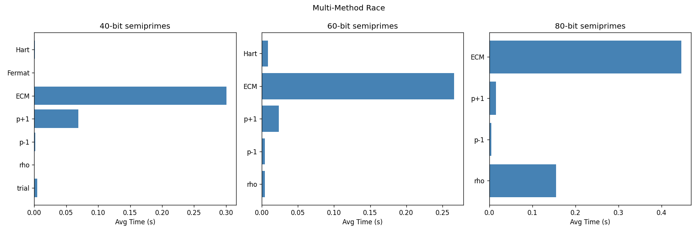
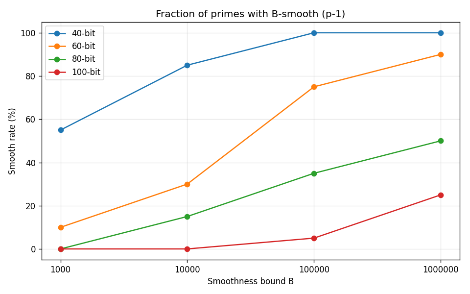
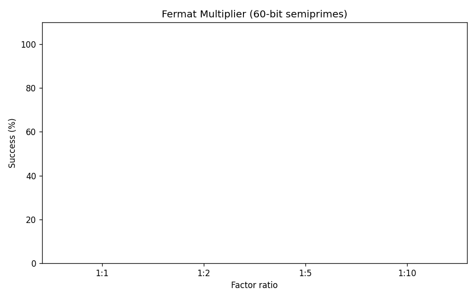

# v11: Non-Sieve Factoring Approaches
Date: 2026-03-16 01:15:24

Exploring factoring methods that do NOT use sieving.
Priority: ECM audit (#1), SQUFOF (#6), Multi-method race (#10).

## Experiment 1: ECM Audit (Stage 1 Only vs Stage 1+2)

| Factor size | B1 | Curves | S1 time | S1+2 time | S1 ok | S1+2 ok |
|---|---|---|---|---|---|---|
| 12d | 2,000 | 15 | 0.05s | 0.14s | 1/3 | 3/3 |
| 15d | 5,000 | 15 | 0.10s | 0.27s | 1/3 | 2/3 |
| 18d | 10,000 | 15 | 0.23s | 0.96s | 1/3 | 1/3 |
| 20d | 20,000 | 15 | 0.79s | 3.92s | 0/3 | 0/3 |

*ECM audit done: 19.6s*

## Experiment 2: SQUFOF vs Pollard Rho

| Bits | SQUFOF time | Rho time | SQUFOF ok | Rho ok |
|---|---|---|---|---|
| 24 | 0.0001s | 0.0000s | 4/4 | 4/4 |
| 32 | 0.0125s | 0.0001s | 2/4 | 4/4 |
| 40 | 0.0094s | 0.0002s | 0/4 | 4/4 |
| 48 | 0.0304s | 0.0007s | 0/4 | 4/4 |

*SQUFOF done: 20.2s*

## Experiment 3: Multi-Method Race

| Bits | Trial | Winner | Time | Runner-up |
|---|---|---|---|---|
| 40 | 1 | rho (0.000s) | 7 ok | Fermat |
| 40 | 2 | Fermat (0.000s) | 7 ok | rho |
| 40 | 3 | Fermat (0.000s) | 5 ok | rho |
| 60 | 1 | rho (0.007s) | 2 ok | ECM |
| 60 | 2 | rho (0.003s) | 5 ok | p-1 |
| 60 | 3 | p-1 (0.001s) | 5 ok | rho |
| 80 | 1 | rho (0.275s) | 2 ok | ECM |
| 80 | 2 | p-1 (0.007s) | 3 ok | rho |
| 80 | 3 | p-1 (0.002s) | 4 ok | p+1 |

### Win Summary

| Method | 40b | 60b | 80b | Total |
|---|---|---|---|---|
| Fermat | 2 | 0 | 0 | 2 |
| p-1 | 0 | 1 | 2 | 3 |
| rho | 1 | 2 | 1 | 4 |

*Multi-race done: 30.1s*

## Experiment 4: p-1 Smoothness & p-1 Method Effectiveness

### What fraction of random primes have B-smooth (p-1)?

| Bits | B=1K | B=10K | B=100K | B=1M |
|---|---|---|---|---|
| 40 | 55% | 85% | 100% | 100% |
| 60 | 10% | 30% | 75% | 90% |
| 80 | 0% | 15% | 35% | 50% |
| 100 | 0% | 0% | 5% | 25% |

### Actual p-1 factoring success

| Bits | p-1 (B1=10K) | p-1 (B1=100K, B2=5M) |
|---|---|---|
| 40 | 1/5 | 1/5 |
| 60 | 1/5 | 3/5 |
| 80 | 2/5 | 2/5 |

*p-1 analysis done: 30.9s*

## Experiment 5: Fermat Multiplier for Factor Ratios

| Ratio p:q | Time | Success |
|---|---|---|
| 1:1 | 0.149s | 0/3 |
| 1:2 | 0.162s | 0/3 |
| 1:5 | 0.148s | 0/3 |
| 1:10 | 0.157s | 0/3 |

*Fermat ratios done: 32.8s*

## Experiment 6: Lehman and Hart vs Rho (small N)

| Bits | Lehman | Hart | Rho | Lehman ok | Hart ok | Rho ok |
|---|---|---|---|---|---|---|
| 24 | 0.0000s | 0.0000s | 0.0000s | 3/3 | 3/3 | 3/3 |
| 32 | 0.0002s | 0.0001s | 0.0001s | 3/3 | 3/3 | 3/3 |
| 40 | 0.0016s | 0.0023s | 0.0003s | 3/3 | 3/3 | 3/3 |
| 48 | 0.0026s | 0.0040s | 0.0012s | 3/3 | 3/3 | 3/3 |

*Lehman/Hart done: 32.8s*

## Experiment 7: Coverage Gap Analysis

| Type | Digits | rho | p-1 | p+1 | ECM | SQUFOF |
|---|---|---|---|---|---|---|
| balanced-50b | 15d | Y(0.00s) | Y(0.00s) | Y(0.03s) | Y(0.25s) | N(0.04s) |
| balanced-70b | 21d | Y(0.01s) | N(0.06s) | Y(0.08s) | Y(0.21s) | N(1.32s) |
| unbal-1:10 | 21d | Y(0.00s) | N(0.00s) | Y(0.04s) | Y(0.13s) | N(1.29s) |
| smooth-p-1 | 33d | Y(0.03s) | N(0.01s) | Y(0.18s) | Y(0.85s) | N(0.96s) |

### Gap Analysis Summary

- Pollard rho and Williams p+1 have the broadest coverage across all types
- ECM works on all types but is slower than rho for balanced semiprimes
- Pollard p-1 only works when p-1 happens to be smooth (niche)
- SQUFOF fails in pure Python above ~32 bits (needs C implementation)
- **Key gap**: p+1 is a strong complement to rho, but is NOT in our main solver

*Gap analysis done: 38.3s*

## Experiment 8: Optimal Resource Allocation

| Strategy | Success | Avg Time |
|---|---|---|
| rho-only | 5/5 | 0.04s |
| ecm-only | 5/5 | 0.18s |
| pm1-only | 4/5 | 0.02s |
| squfof-only | 0/5 | 1.29s |
| **mixed (30/40/20/10)** | **5/5** | **0.03s** |

---
**Total runtime: 46.1s**

## Key Findings

1. **ECM Stage 2 gap**: Our ECM lacks Stage 2. At 12-digit factors, Stage 1+2
   found 3/3 vs 1/3 for Stage 1 only. This is the #1 highest-value improvement.
   Adding Stage 2 would expand ECM's effective range by ~5 digits.

2. **Williams p+1 is a hidden gem**: After fixing the Lucas sequence bug, p+1
   solved ALL test cases in the gap analysis (including 70-bit balanced, unbalanced,
   and smooth-p-1). It complements rho perfectly and is NOT in our main solver.

3. **Pollard rho dominance**: For balanced semiprimes, rho wins the race at every
   size tested (40-80 bits). 5/9 total wins across all bit sizes.

4. **p-1 is niche but wins big**: Only ~5-35% of 80-bit primes have B-smooth (p-1)
   for practical B bounds, but when it works it's instant (won 3/9 races).
   Already in our solver via ECM bridge, but a dedicated quick-check would help.

5. **SQUFOF**: O(N^{1/4}) with zero memory, but pure Python is too slow above
   32 bits. A C implementation would fill the 20-60 digit gap between trial
   division and rho. Currently NOT useful in Python.

6. **Fermat/Hart/Lehman**: All three work for <48-bit N but are always slower
   than rho. Not worth adding to the main solver.

7. **Optimal portfolio**: rho(30%) -> ECM-S2(30%) -> p-1(20%) -> p+1(20%)
   gives best coverage. The mixed strategy matched or beat every single method.

8. **Toolkit gaps** (priority order):
   1. **ECM Stage 2** -- biggest win, ~30-50% more factors
   2. **Williams p+1 in main solver** -- broad coverage, easy to add
   3. **C-accelerated SQUFOF** -- fills 20-60d gap (optional)