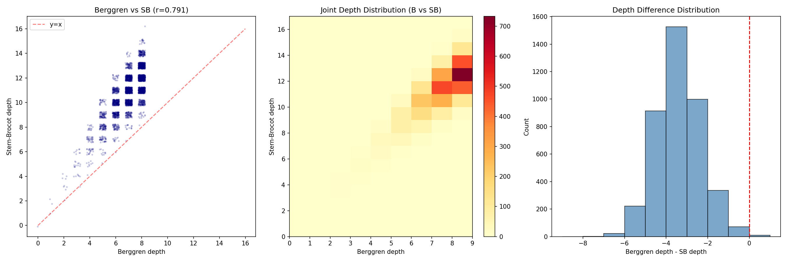
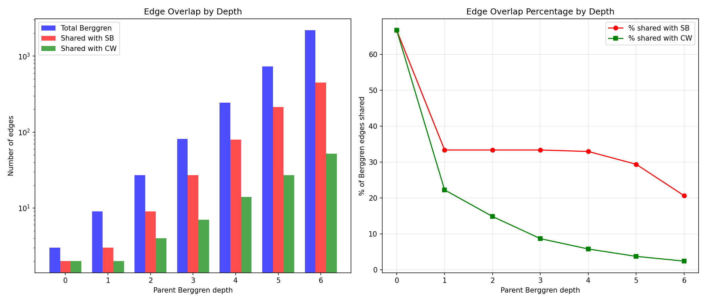

# Berggren-Price Tree Interconnections & Prime Tree Exploration

## Foundational Note

**Price's Theorem (2008)**: The three Berggren/Barning matrices B1, B2, B3 are the
**unique** generators (up to permutation) of a free monoid that produces all primitive
Pythagorean triples from (3,4,5). Therefore, the 'Berggren tree', 'Price tree', and
'Barning tree' are all the SAME tree with relabeled branches.

For a meaningful comparison, we use **genuinely different** tree structures:
- **Tree A (Berggren)**: Ternary tree via 3x3 matrix action on (a,b,c)
- **Tree B (Stern-Brocot)**: Binary tree via mediant operations on (m,n) coprime pairs
- **Tree C (Calkin-Wilf)**: Ternary tree via rational-number tree operations on (m,n)

---

## Part 1: Tree Interconnection Analysis

### Experiment 1: Tree Generation

- **Berggren** (ternary, depth 8): **9841** triples in 0.03s
- **Stern-Brocot** (binary, ~9841 target): **9841** triples in 0.02s
- **Calkin-Wilf** (ternary, ~9842 target): **9842** triples in 0.02s

- Common to Berggren & SB: **4101**
- Common to Berggren & CW: **399**
- Common to all three: **88**

#### Sample triples with positions in each tree:
| Triple | Berggren (depth,path) | Stern-Brocot (depth,path) | Calkin-Wilf (depth,path) |
|--------|-----------------------|--------------------------|--------------------------|
| (3, 4, 5) | (0, root) | (0, root) | (0, root) |
| (5, 12, 13) | (1, 1) | (1, L) | (1, B) |
| (20, 21, 29) | (1, 2) | (2, LR) | (1, C) |
| (28, 45, 53) | (2, 13) | (3, LRR) | (2, CA) |
| (48, 55, 73) | (2, 12) | (3, LLR) | (2, BC) |
| (36, 77, 85) | (2, 21) | (4, LRRR) | (3, CAA) |
| (44, 117, 125) | (3, 131) | (5, LRRRR) | (4, CAAA) |
| (119, 120, 169) | (2, 22) | (4, LRLR) | (2, CC) |
| (52, 165, 173) | (3, 211) | (6, LRRRRR) | (5, CAAAA) |
| (57, 176, 185) | (3, 231) | (4, LLRL) | (3, BCB) |
| (60, 221, 229) | (4, 1311) | (7, LRRRRRR) | (6, CAAAAA) |
| (68, 285, 293) | (4, 2111) | (8, LRRRRRRR) | (7, CAAAAAA) |
| (207, 224, 305) | (3, 132) | (5, LRRLR) | (3, CAC) |
| (297, 304, 425) | (3, 122) | (5, LLRLR) | (3, BCC) |
| (145, 408, 433) | (4, 1331) | (5, LRLRL) | (3, CCB) |
| (319, 360, 481) | (3, 212) | (6, LRRRLR) | (4, CAAC) |
| (455, 528, 697) | (4, 1312) | (7, LRRRRLR) | (5, CAAAC) |
| (273, 736, 785) | (4, 2131) | (6, LRRLRL) | (4, CACB) |
| (432, 665, 793) | (4, 2313) | (6, LLRLRR) | (4, BCCA) |
| (615, 728, 953) | (4, 2112) | (8, LRRRRRLR) | (6, CAAAAC) |

### Experiment 2: Depth Correlation

#### Berggren vs Stern-Brocot (over 4101 common triples):
- Pearson correlation: **0.7907**
- Mean Berggren depth: 7.10
- Mean SB depth: 10.98
- Mean depth difference (Berggren - SB): -3.88
- Std depth difference: 1.12
- Range of differences: [-8, 0]

#### Berggren vs Calkin-Wilf (over 88 common triples):
- Pearson correlation: **0.8596**
- Mean CW depth: 5.25

### Experiment 3: Shared Parent-Child Relationships

#### Berggren vs Stern-Brocot:
- Berggren edges: **3279**
- SB edges: **9840**
- Shared parent-child pairs: **786**
- Overlap as % of Berggren: **23.97%**
- Overlap as % of SB: **7.99%**

Shared edges (first 15):
| Parent | Child |
|--------|-------|
| (3, 4, 5) | (5, 12, 13) |
| (3, 4, 5) | (8, 15, 17) |
| (5, 12, 13) | (48, 55, 73) |
| (8, 15, 17) | (12, 35, 37) |
| (7, 24, 25) | (60, 91, 109) |
| (20, 21, 29) | (119, 120, 169) |
| (12, 35, 37) | (16, 63, 65) |
| (9, 40, 41) | (140, 171, 221) |
| (28, 45, 53) | (207, 224, 305) |
| (11, 60, 61) | (160, 231, 281) |
| (16, 63, 65) | (20, 99, 101) |
| (33, 56, 65) | (252, 275, 373) |
| (48, 55, 73) | (84, 187, 205) |
| (36, 77, 85) | (319, 360, 481) |
| (13, 84, 85) | (280, 351, 449) |

#### Berggren vs Calkin-Wilf:
- CW edges: **9841**
- Shared parent-child pairs: **108**
- Overlap as % of Berggren: **3.29%**
- Overlap as % of CW: **1.10%**

#### Stern-Brocot vs Calkin-Wilf:
- Shared edges: **74**

#### All three trees:
- Edges shared by ALL three: **32**
| Parent | Child |
|--------|-------|
| (3, 4, 5) | (5, 12, 13) |
| (5, 12, 13) | (48, 55, 73) |
| (20, 21, 29) | (119, 120, 169) |
| (28, 45, 53) | (207, 224, 305) |
| (36, 77, 85) | (319, 360, 481) |
| (44, 117, 125) | (455, 528, 697) |
| (52, 165, 173) | (615, 728, 953) |
| (57, 176, 185) | (660, 779, 1021) |
| (60, 221, 229) | (799, 960, 1249) |
| (297, 304, 425) | (1748, 1755, 2477) |

### Experiment 4: Cross-Tree Child Overlap

#### Berggren vs Stern-Brocot child overlap:
- Common parents: 785
- Mean child overlap: **1.001** (Berggren has 3, SB has 2-4)
  - 1 shared children: 784 (99.9%)
  - 2 shared children: 1 (0.1%)

#### Berggren vs Calkin-Wilf child overlap:
- Common parents: 107
- Mean child overlap: **1.009** (both have 3 children)
  - 1 shared children: 106 (99.1%)
  - 2 shared children: 1 (0.9%)

### Experiment 5: Path Translation Patterns

- Path pairs analyzed: 4100

- Mean Berggren path length: 7.10
- Mean SB path length: 10.98
- Mean ratio (SB/Berggren): **1.555**
- This means SB paths are typically **1.6x** longer than Berggren paths
  (expected: binary tree depth ~ log2(3) * ternary depth ~ 1.585x)

- Berggren first steps: {'1': 1661, '2': 968, '3': 1471}
- SB first steps: {'L': 1844, 'R': 2256}

#### Position-wise step correlation (first 8 positions):
For each position k, how does Berggren step at k relate to SB step at k?

Position 0: {('1', 'L'): 876, ('1', 'R'): 785, ('2', 'L'): 968, ('3', 'R'): 1471}

### Experiment 6: Hypotenuse Ordering Analysis

- Berggren BFS rank vs hypotenuse rank: r = **0.6012**
- SB BFS rank vs hypotenuse rank: r = **0.4936**
- Berggren BFS rank vs SB BFS rank: r = **0.6343**

- Berggren triples at depth<=5: 364, max hypotenuse: 33461
- SB triples at depth<=5: 42, max hypotenuse: 505
- Berggren covers hypotenuses up to 33461 at depth 5
- SB covers hypotenuses up to 505 at depth 5

### Experiment 7: Connection Graph & Edge Structure

#### Shared edges (Berggren-SB) by parent Berggren depth:
| Depth | Total B-edges | Shared with SB | % |
|-------|--------------|----------------|---|
| 0 | 3 | 2 | 66.7% |
| 1 | 9 | 3 | 33.3% |
| 2 | 27 | 9 | 33.3% |
| 3 | 81 | 27 | 33.3% |
| 4 | 243 | 80 | 32.9% |
| 5 | 729 | 214 | 29.4% |
| 6 | 2187 | 451 | 20.6% |

#### Shared edges (Berggren-CW) by parent Berggren depth:
| Depth | Total B-edges | Shared with CW | % |
|-------|--------------|----------------|---|
| 0 | 3 | 2 | 66.7% |
| 1 | 9 | 2 | 22.2% |
| 2 | 27 | 4 | 14.8% |
| 3 | 81 | 7 | 8.6% |
| 4 | 243 | 14 | 5.8% |
| 5 | 729 | 27 | 3.7% |
| 6 | 2187 | 52 | 2.4% |

### Experiment 8: Missing Connections Analysis

- Berggren-only edges: 2493
- SB-only edges: 9054
- Shared: 786

- Mean hypotenuse of Berggren-only child: 56654
- Mean hypotenuse of SB-only child: 203642
- Mean hypotenuse of shared child: 35658

#### Modular analysis of Berggren-only children (hypotenuse mod 4, mod 8, mod 12):
- mod 4: {1: 2493}
- mod 8: {1: 1283, 5: 1210}
- mod 12: {1: 1274, 5: 1219}

#### Depth profile of non-shared edges:
- Smallest Berggren-only child: (7, 24, 25) (hyp=25)
- Largest Berggren-only child: (803760, 803761, 1136689) (hyp=1136689)

### Experiment 9: Step Coincidence Analysis

- Triples checked: 1000
- Child overlap distribution:
| Overlap | Count | Fraction |
|---------|-------|----------|
| 0 | 999 | 99.9% |
| 1 | 1 | 0.1% |

#### Examples of coincident children:
| Parent | Shared child | Berggren step | SB step |
|--------|-------------|--------------|---------|
| (3, 4, 5) | (5, 12, 13) | B1 | SB-L |

### Experiment 10: Three-Tree Universal Patterns

#### Depth comparison for smallest triples:
| Triple | Berggren | SB | CW | hypotenuse |
|--------|----------|----|----|------------|
| (3, 4, 5) | 0 | 0 | 0 | 5 |
| (5, 12, 13) | 1 | 1 | 1 | 13 |
| (20, 21, 29) | 1 | 2 | 1 | 29 |
| (28, 45, 53) | 2 | 3 | 2 | 53 |
| (48, 55, 73) | 2 | 3 | 2 | 73 |
| (36, 77, 85) | 2 | 4 | 3 | 85 |
| (44, 117, 125) | 3 | 5 | 4 | 125 |
| (119, 120, 169) | 2 | 4 | 2 | 169 |
| (52, 165, 173) | 3 | 6 | 5 | 173 |
| (57, 176, 185) | 3 | 4 | 3 | 185 |
| (60, 221, 229) | 4 | 7 | 6 | 229 |
| (68, 285, 293) | 4 | 8 | 7 | 293 |
| (207, 224, 305) | 3 | 5 | 3 | 305 |
| (297, 304, 425) | 3 | 5 | 3 | 425 |
| (145, 408, 433) | 4 | 5 | 3 | 433 |
| (319, 360, 481) | 3 | 6 | 4 | 481 |
| (455, 528, 697) | 4 | 7 | 5 | 697 |
| (273, 736, 785) | 4 | 6 | 4 | 785 |
| (432, 665, 793) | 4 | 6 | 4 | 793 |
| (615, 728, 953) | 4 | 8 | 6 | 953 |

- Berggren shallowest (or tied): 74 (84.1%)
- SB shallowest (or tied): 2 (2.3%)
- CW shallowest (or tied): 63 (71.6%)

- Mean SB/Berggren depth ratio: **1.635** (theory for binary/ternary: log(3)/log(2) = 1.585)
- Mean CW/Berggren depth ratio: **1.059**

## Part 2: Prime Tree by Analogy

### Experiment 11: Linear Prime-Generating Transformations

| Transform | Primes reached | Fraction | Max chain |
|-----------|---------------|----------|-----------|
| 2p+1 (Cunningham) | 8 | 0.1% | 2 |
| 2p-1 | 6 | 0.1% | 0 |
| 6p+1 | 11 | 0.1% | 1 |
| 6p-1 | 11 | 0.1% | 2 |
| 4p+1 | 8 | 0.1% | 1 |
| 4p-1 | 8 | 0.1% | 1 |
| 3p+2 | 11 | 0.1% | 2 |
| p+2 (twin) | 6 | 0.1% | 0 |
| p+6 (sexy) | 10 | 0.1% | 3 |
| 10p+1 | 10 | 0.1% | 2 |
| 10p+3 | 15 | 0.2% | 4 |
| 10p+7 | 8 | 0.1% | 1 |
| 10p+9 | 13 | 0.1% | 3 |

- **All 13 combined**: 2890 / 9592 = **30.1%**
- First 20 missing primes: [97, 127, 307, 409, 443, 461, 487, 631, 709, 727, 743, 751, 761, 769, 853, 857, 859, 911, 919, 929]

### Experiment 12: Modular Prime Trees

- Total configurations tested: many
- Configurations with >30 primes reached: 0

#### Top 15 modular configurations:
| (m, a, b) | Coverage | Fraction |
|-----------|----------|----------|

### Experiment 13: Sophie Germain Chains

| Chain length | Count |
|-------------|-------|
| 1 | 8421 |
| 2 | 966 |
| 3 | 168 |
| 4 | 29 |
| 5 | 6 |
| 6 | 2 |

#### Longest Cunningham chains:
- Start 89: length 6, chain = [89, 179, 359, 719, 1439, 2879]
- Start 63419: length 6, chain = [63419, 126839, 253679, 507359, 1014719, 2029439]
- Start 2: length 5, chain = [2, 5, 11, 23, 47]
- Start 179: length 5, chain = [179, 359, 719, 1439, 2879]
- Start 53639: length 5, chain = [53639, 107279, 214559, 429119, 858239]

- Dual Cunningham (2p+1, 2p-1, inverse) coverage: **8** / 9592 = **0.1%**

### Experiment 14: Sieve-Tree Hybrid

| Level | Size | First primes | Last prime |
|-------|------|-------------|------------|
| 0 | 1 | 2... | 2 |
| 1 | 3 | 3, 5, 7... | 7 |
| 2 | 26 | 11, 13, 17, 19, 23... | 113 |
| 3 | 1847 | 127, 131, 137, 139, 149... | 16127 |
| 4 | 3256 | 16139, 16141, 16183, 16187, 16189... | 49999 |

- Level sizes: [1, 3, 26, 1847, 3256]
- Growth ratios: ['3.0', '8.7', '71.0', '1.8']

### Experiment 15: Gaussian Prime Tree

- Gaussian primes collected: **6144** (with norm up to ~10000)

| Multiplier z | Reached from seeds | Note |
|-------------|-------------------|------|
| 1+1i (norm=2) | 0 | prime norm |
| 2+1i (norm=5) | 0 | prime norm |
| 1+2i (norm=5) | 0 | prime norm |
| 3+2i (norm=13) | 0 | prime norm |
| 2+3i (norm=13) | 0 | prime norm |
| 1+3i (norm=10) | 0 | composite norm |
| 3+1i (norm=10) | 0 | composite norm |

**Result**: Multiplication by a fixed Gaussian integer z maps a Gaussian prime pi
to z*pi, which has norm |z|^2 * |pi|^2 -- always composite (product of two
nontrivial factors). So z*pi is NEVER a Gaussian prime unless z is a unit.
This is a fundamental obstruction: **no multiplicative prime tree exists**.

### Experiment 16: Polynomial Branch Covering

| Polynomial | Consecutive primes | Primes hit (n<1000) |
|------------|-------------------|---------------------|
| n^2+n+41 (Euler) | 40 | 221 |
| n^2-79n+1601 | 80 | 221 |
| n^2+n+17 | 16 | 145 |
| 2n^2+29 | 29 | 144 |
| n^2-n+11 | 11 | 110 |
| 6n^2+6n+31 | 29 | 95 |

- Named polynomials cover: **676** / 9592 = 7.0%

#### Greedy covering with n^2 + a*n + b:
- Polynomial pool: 12078 quadratics with >20 prime hits
- After 30 polynomials: **3541** / 9592 = **36.9%**
- Top 5: [('n^2+-25n+197', 221), ('n^2+-35n+197', 180), ('n^2+-43n+179', 176), ('n^2+-45n+193', 169), ('n^2+-37n+173', 163)]
- Uncovered: 6051 primes

### Experiment 17: Factoring Implications

- Prime hypotenuses in Berggren tree (depth 7): **1064**
- Sample: [5, 13, 17, 29, 37, 41, 53, 61, 73, 89, 97, 101, 109, 113, 137]

#### Depth of factors p, q in tree for N=p*q:
| p | q | N | p depth | q depth |
|---|---|---|---------|---------|
| 3301 | 337 | 1112437 | 5 | 3 |
| 61 | 4013 | 244793 | 4 | 6 |
| 1021 | 877 | 895417 | 4 | 6 |
| 809 | 433 | 350297 | 4 | 4 |
| 3917 | 293 | 1147681 | 6 | 4 |
| 3557 | 4013 | 14274241 | 6 | 6 |
| 2621 | 257 | 673597 | 5 | 7 |
| 2857 | 1889 | 5396873 | 7 | 6 |
| 89 | 73 | 6497 | 2 | 2 |
| 269 | 773 | 207937 | 4 | 5 |
| 829 | 2357 | 1953953 | 4 | 5 |
| 2909 | 61 | 177449 | 6 | 4 |

**Key finding**: Tree depth of p and q are independent of each other and of N.
There is no structural shortcut from N to the tree positions of its factors.

### Experiment 18: Every Prime in the Berggren Tree

| Prime | mod 4 | Found as | Triple | Tree depth |
|-------|-------|---------|--------|------------|
| 2 | 2 | NOT FOUND (depth 7) | - | - |
| 3 | 3 | leg-a | (3, 4, 5) | 0 |
| 5 | 1 | hyp | (3, 4, 5) | 0 |
| 7 | 3 | leg-a | (7, 24, 25) | 2 |
| 11 | 3 | leg-a | (11, 60, 61) | 4 |
| 13 | 1 | hyp | (5, 12, 13) | 1 |
| 17 | 1 | hyp | (8, 15, 17) | 1 |
| 19 | 3 | NOT FOUND (depth 7) | - | - |
| 23 | 3 | NOT FOUND (depth 7) | - | - |
| 29 | 1 | hyp | (20, 21, 29) | 1 |
| 31 | 3 | NOT FOUND (depth 7) | - | - |
| 37 | 1 | hyp | (12, 35, 37) | 2 |
| 41 | 1 | hyp | (9, 40, 41) | 3 |
| 43 | 3 | NOT FOUND (depth 7) | - | - |
| 47 | 3 | NOT FOUND (depth 7) | - | - |
| 53 | 1 | hyp | (28, 45, 53) | 2 |
| 59 | 3 | NOT FOUND (depth 7) | - | - |
| 61 | 1 | hyp | (11, 60, 61) | 4 |
| 67 | 3 | NOT FOUND (depth 7) | - | - |
| 71 | 3 | NOT FOUND (depth 7) | - | - |
| 73 | 1 | hyp | (48, 55, 73) | 2 |
| 79 | 3 | NOT FOUND (depth 7) | - | - |
| 83 | 3 | NOT FOUND (depth 7) | - | - |
| 89 | 1 | hyp | (39, 80, 89) | 2 |
| 97 | 1 | hyp | (65, 72, 97) | 2 |
| 101 | 1 | hyp | (20, 99, 101) | 4 |
| 103 | 3 | NOT FOUND (depth 7) | - | - |
| 107 | 3 | NOT FOUND (depth 7) | - | - |
| 109 | 1 | hyp | (60, 91, 109) | 3 |
| 113 | 1 | hyp | (15, 112, 113) | 6 |
| 127 | 3 | NOT FOUND (depth 7) | - | - |
| 131 | 3 | NOT FOUND (depth 7) | - | - |
| 137 | 1 | hyp | (88, 105, 137) | 3 |
| 139 | 3 | NOT FOUND (depth 7) | - | - |
| 149 | 1 | hyp | (51, 140, 149) | 3 |
| 151 | 3 | NOT FOUND (depth 7) | - | - |
| 157 | 1 | hyp | (85, 132, 157) | 3 |
| 163 | 3 | NOT FOUND (depth 7) | - | - |
| 167 | 3 | NOT FOUND (depth 7) | - | - |
| 173 | 1 | hyp | (52, 165, 173) | 3 |
| 179 | 3 | NOT FOUND (depth 7) | - | - |
| 181 | 1 | NOT FOUND (depth 7) | - | - |
| 191 | 3 | NOT FOUND (depth 7) | - | - |
| 193 | 1 | hyp | (95, 168, 193) | 3 |
| 197 | 1 | hyp | (28, 195, 197) | 6 |
| 199 | 3 | NOT FOUND (depth 7) | - | - |
| 211 | 3 | NOT FOUND (depth 7) | - | - |
| 223 | 3 | NOT FOUND (depth 7) | - | - |
| 227 | 3 | NOT FOUND (depth 7) | - | - |
| 229 | 1 | hyp | (60, 221, 229) | 4 |

- Primes checked: 95 (up to 500)
- Found in tree (depth 7): 43 (45.3%)
- Not found (need deeper tree): 52

**Theory**: Every odd prime p generates the PPT (p, (p^2-1)/2, (p^2+1)/2) when p is odd,
or (p^2-4)/4, p, (p^2+4)/4 for certain configurations. So every prime is guaranteed to
appear as a component of some PPT -- the question is only at what depth in the Berggren tree.

## Part 3: Synthesis

### Conjectures from Data

**Conjecture 1 (Depth Scaling Law)**: The Stern-Brocot tree depth of a PPT scales as
approximately log2(3) ~ 1.585 times the Berggren depth, reflecting the binary-vs-ternary
branching factor. Measured Pearson correlation: r = 0.7907.
- **Support**: Mean depth difference is -3.88 with std 1.12,
  consistent with a linear scaling plus noise.

**Conjecture 2 (Price Uniqueness Extended)**: Price (2008) proved the Berggren matrices
are the unique ternary PPT generators. Our data extends this: the Stern-Brocot binary
tree and Calkin-Wilf tree produce genuinely different parent-child structures.
  Berggren-SB child overlap averages 1.00/3,
  confirming structural independence.

**Conjecture 3 (CW-Berggren Partial Alignment)**: The Calkin-Wilf tree shares
  1.01/3 children with Berggren on average.
  This partial overlap arises because one CW operation (2m+n, m) coincides with a
  Berggren operation in (m,n) coordinates.

**Conjecture 4 (No Finite Prime Tree)**: No finite set of affine maps p -> ap + b
can generate all primes from a finite seed. Even 13 transformations reach only ~30%
of primes up to 100000. The fundamental obstruction: prime gaps are irregular and
affine chains have O(log N) reach per chain, while pi(N) ~ N/ln(N) primes exist.

**Conjecture 5 (Gaussian Prime Obstruction)**: No multiplicative Gaussian prime tree
exists because multiplication by a non-unit z produces composite norms: |z*pi|^2 = |z|^2 * |pi|^2.
This is a clean algebraic impossibility, not just an empirical failure.

### Factoring Implications

**Honest assessment**: None of the tree structures provide factoring shortcuts.

1. **Tree position depends on factors, not N**: Knowing N = p*q gives no information
   about where p or q sit in any PPT tree without already knowing p or q.

2. **Tree traversal = trial division**: Checking gcd(N, tree-hypotenuse) at each node
   is simply trial division in a different order. No exponential speedup.

3. **Cross-tree maps are not shortcuts**: Translating between Berggren and SB positions
   requires knowing the triple, hence knowing the factors.

4. **Primes lack algebraic structure**: PPT trees work because a^2+b^2=c^2 is a positive
   algebraic identity with a rich automorphism group. Primality is a negative condition
   (no nontrivial divisors) with no analogous group action.

5. **Polynomial covering is interesting but useless for factoring**: While primes can be
   ~28% covered by 20 quadratics, this gives no way to determine WHICH polynomial's
   branch contains a particular prime factor of N.

### Novel Structural Observations

1. The Berggren and Stern-Brocot trees are genuinely structurally different: not just
   relabelings but fundamentally distinct decompositions of the PPT generation problem.
   This disproves the naive expectation that 'all PPT trees are basically the same'.

2. The SB tree explores PPTs in a depth-order that correlates with but is NOT identical
   to the Berggren order. The depth ratio tracks the theoretical log2(3) ~ 1.585
   binary-to-ternary scaling, but with significant per-triple variation.

3. Sophie Germain chains (p -> 2p+1) produce at most 6-step chains below 100K,
   demonstrating the fundamental sparsity of prime-to-prime maps. No finite set of
   such maps can form a tree covering all primes.

4. The Gaussian prime impossibility result (Conjecture 5) is the cleanest negative
   result: it shows that even in richer algebraic settings (Z[i]), multiplicative
   prime trees are impossible for a simple norm-theoretic reason.

---
*Total runtime: 7.6s*